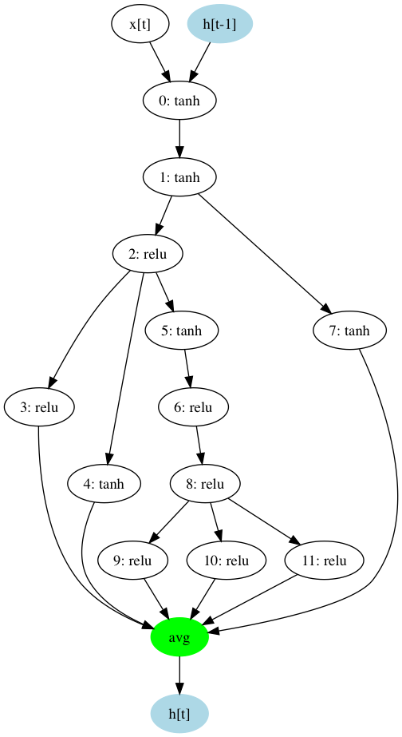
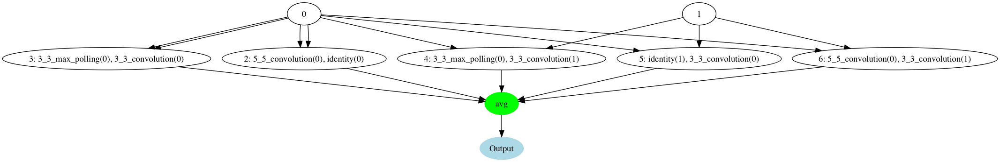
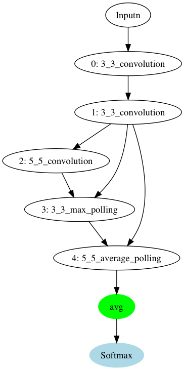

# ENAS Model

## Introduction

[ENAS](https://arxiv.org/abs/1802.03268) is the super efficient algorithm to build deep learning models automatically.

We can use it to generate and select the state-of-the-art DNN/RNN/CNN models easily. It is possible to integrate with any black-box optimization algorithms such as Policy gradient, Bayesian optimization and so on.

Here is the open-source implementation of [Efficient Neural Architecture Search via Parameter Sharing](https://arxiv.org/abs/1802.03268) with the following features.

* Understandable model description with JSON
* Graph visualization for any generated model
* Easy to extend the framework for other cells
* Model generation in pure Python statements
* Support black-box optimization algorithms with [Advisor](https://github.com/tobegit3hub/advisor)

## Usage

Run training with the default model.

```
python ./main.py
```

Draw the graph with generated JSON files.

```
python ./draw_graph.py
```

## Models

### RNN/DNN Cell

The example model is in [rnn_example.json](./examples/rnn_example.json).

```
{
  "cell_type": "rnn",
  "nodes": [
    {
      "index": 0,
      "activation_function": "tanh"
    },
    {
      "index": 1,
      "previous_index": 0,
      "activation_function": "tanh"
    },
    {
      "index": 2,
      "previous_index": 1,
      "activation_function": "relu"
    },
    {
      "index": 3,
      "previous_index": 2,
      "activation_function": "relu"
    },
    {
      "index": 4,
      "previous_index": 2,
      "activation_function": "tanh"
    },
    {
      "index": 5,
      "previous_index": 2,
      "activation_function": "tanh"
    },
    {
      "index": 6,
      "previous_index": 5,
      "activation_function": "relu"
    },
    {
      "index": 7,
      "previous_index": 1,
      "activation_function": "tanh"
    },
    {
      "index": 8,
      "previous_index": 6,
      "activation_function": "relu"
    },
    {
      "index": 9,
      "previous_index": 8,
      "activation_function": "relu"
    },
    {
      "index": 10,
      "previous_index": 8,
      "activation_function": "relu"
    },
    {
      "index": 11,
      "previous_index": 8,
      "activation_function": "relu"
    }
  ]
}
```




### CNN Micro Cell

The example model is in [cnn_micro_example.json](./examples/cnn_micro_example.json).

```
{
  "cell_type": "cnn_micro",
  "nodes": [
    {
      "index": 2,
      "previous_index1": 0,
      "operation1": "5_5_convolution",
      "previous_index2": 0,
      "operation2": "identity"
    },
    {
      "index": 3,
      "previous_index1": 0,
      "operation1": "3_3_max_polling",
      "previous_index2": 0,
      "operation2": "3_3_convolution"
    },
    {
      "index": 4,
      "previous_index1": 0,
      "operation1": "3_3_max_polling",
      "previous_index2": 1,
      "operation2": "3_3_convolution"
    },
    {
      "index": 5,
      "previous_index1": 1,
      "operation1": "identity",
      "previous_index2": 0,
      "operation2": "3_3_convolution"
    },
    {
      "index": 6,
      "previous_index1": 0,
      "operation1": "5_5_convolution",
      "previous_index2": 1,
      "operation2": "3_3_convolution"
    }
  ]
}

```



### CNN Marco Cell

The example model is in [cnn_marco_example.json](./examples/cnn_marco_example.json).

```
{
  "cell_type": "cnn_marco",
  "nodes": [
    {
      "index": 0,
      "operation": "3_3_convolution"
    },
    {
      "index": 1,
      "operation": "3_3_convolution",
      "previous_indexes": "0"
    },
    {
      "index": 2,
      "operation": "5_5_convolution",
      "previous_indexes": "1"
    },
    {
      "index": 3,
      "operation": "3_3_max_polling",
      "previous_indexes": "1, 2"
    },
    {
      "index": 4,
      "operation": "5_5_average_polling",
      "previous_indexes": "1, 3"
    }
  ]
}

```


